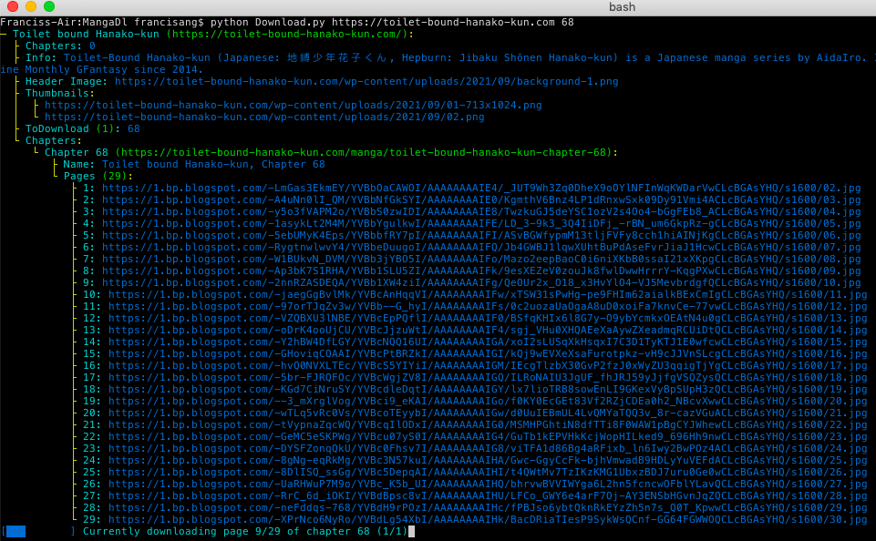
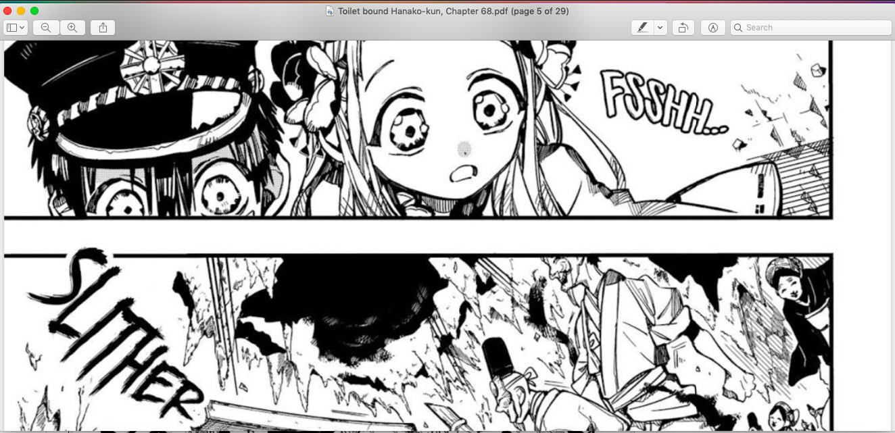

# MangaDl, a tool to download manga from *certain manga websites*
## Usage
Run as `python3 Download.py ((<link to website> <range of chapters>|<link to website at manga chapter>) [to <folder>])...`  
The result will be stored in the directory after `to`, which is an optional argument. If `{}` is contained in the provided directory, the name of the chapter will be substituted into the {}. For example, `../Mangas/tbhk {}.pdf` to append `tbhk ` to the start of the files. If there is no `{}`, it will default to `{}.pdf`  
`\<link to website\>` is a link, like `toilet-bound-hanako-kun.com`  
`<link to website at manga chapter>` is a link, but at the manga chapter you want to download. eg. `https://madeinabyssmanga.com/manga/made-in-abyss-chapter-60/`
For example, run `python3 Download.py https://toilet-bound-hanako-kun.com 1,36-82` to download chapters 1 and 36-82 of '`Toilet Bound Hanako-kun`' into the current folder as `[chapter name].pdf`  
Ranges are [number-number] or [number], seperated by commas (69-12,109,21-22 and 129) or - to just extract data from the site and + for all  
### What sites are valid
Sites that have headers that look like these:  
  
  
  
Can be used with the script
## Installation
```bash
pip install lxml Pillow PyPDF2 requests beautifulsoup4
git clone https://github.com/lomnom/MangaDl
```
## Uninstallation
Just remove the folder that was cloned
## Screenshots
  
  